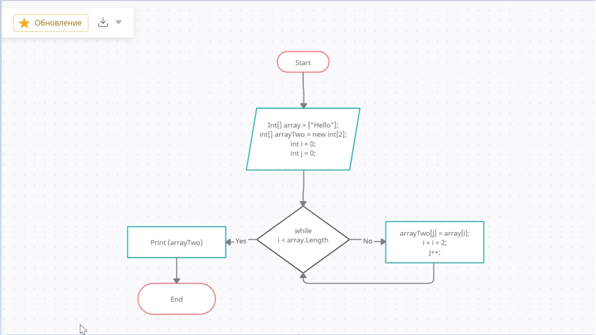

Дана задача: 
Написать программу, которая из имеющегося массива срок формирует массив из строк, длинна которых меньше или равна 3 символа. 
Первчоначальный массив можно задать на старте выполнения алгоритма (программы) или ввести с клавиатуры.
При решении не рекомендуется пользоваться коллекциями, лучше использовать исключительно массивы. 

**Для решения задачи будем использовать язык программирования c#**

 1. Зададим строчный массив из слов, например:
 >string[] array = {"Мой", "папа", "никогда", "не", "был", "в", "Египте", "но", "всегда", "мечтал", "там", "побывать"};

 2. Вторым шагом зададим новый строчный массив, в который будем складывать нужные нам значения. Для удобства используем тип *var*, который определит тип локальной переменной из типа присваиваемого ей значения

 > var arrayOne = new string[array.Length];

 3. Теперь зададим переменную с таким же типом  *var*, назовем её  *size*, она послужит счетчиком: 

 >var size  = 0;

 4. Четвертым шагом пропишем цикл для решения нашей задачки, можно прописать через  *for*, но мы будем использовать  *foreach*. Он удобнее и более подходит для решения нашей задачки: 

- foreach (var value in array) 
- {
    - if (value.Length <= 3)
    - {
        - arrayOne[size] = value;
        - size++;
    - }
- }

5. Последним шагом выведем в консоль получившийся массив: 
>Console.Write(string.Join(Environtment.NewLine, arrayOne, 0, size));

Таким вот простым способом мы решили данную задачу, использовав цикл *foreach*. Если данное решение показалось сложным, можно решить при помощи цикла  *for*, о ктором я говорила ранее: 

>for(int i = 0; i < value.Length; i++ )
- {
    - string arrayOne = value[i];
    - if (arrayOne. Length <3)
    - Console.Write(arrayOne);
- }

